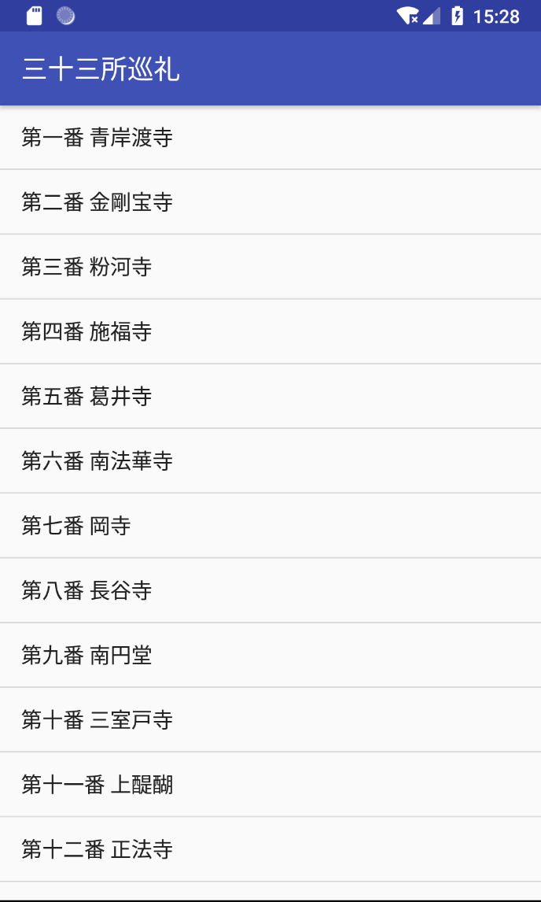
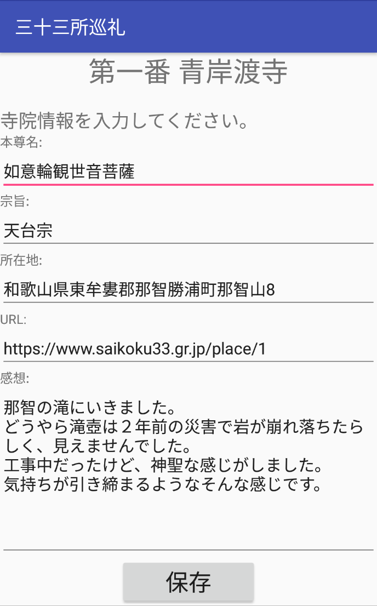

# Saigoku33

## デザイン
  
**android**
  

## 概要

androidstudioの練習のために作ってみました。 
1st画面で寺院を選択し、2nd画面で編集します。 
2nd画面はエミュレータ内のdbで作成、参照されています。

### 作成のポイント
> dbの利用に挑戦 
> 利用目的を考えて無駄がないようにできるだけ簡素に作成

## 使用言語
java